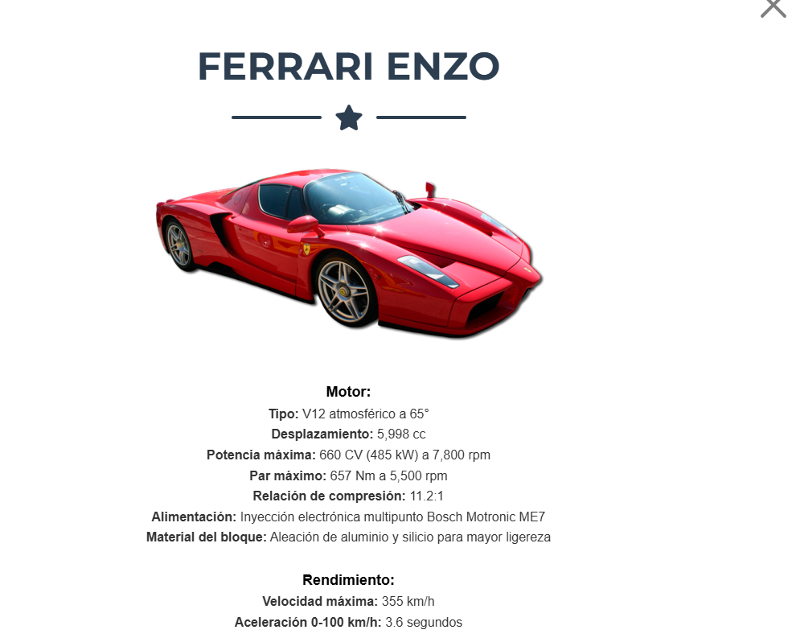
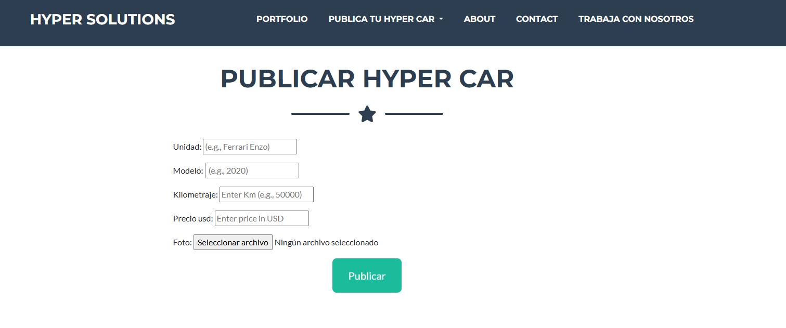
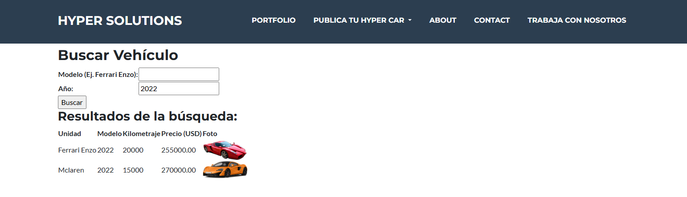

# Arandiga_Proyecto

15/12 17:45hs ( Requerimientos cumplidos)

Es una pagina de super autos "http://127.0.0.1:8000/APP/inicio/" esa seria el home.. 

El Nav consta de:
-Portfolio: Es la pestaña de Inicio - Hay una lista de los autos en cartera. La Ferrari Enzo es la unica desarrollada. Podes darle click y te muestra una descripcion de la unidad 

-Publica tu Hyper Car :  Hay un desplegable. Formulario 1/3 - 

Aqui podes publicar tu Auto, adjuntando detalles y podes subir una foto tambien. 

En el segundo desplegable tenes "Autos ya en Agencia", aqui tenes un search donde podes buscar por modelo y por año las unidades en cartera cargadas por clientes

Aca tambien se realizo el desarrollo para renderizar las imagenes de lo cargado por clientes.

-[ABOUT](http://127.0.0.1:8000/APP/acercade/): Aca es una descripcion de la empresa

-[CONTACT](http://127.0.0.1:8000/APP/formulario/): Formulario 2/3 Aqui hay un formulario de contacto.

-[TRABAJA CON NOSOTROS](http://127.0.0.1:8000/APP/publicar_cv/): Formulario 3/3 Formulario donde se puede cargar CV y datos de interesados en trabajar en la empresa

